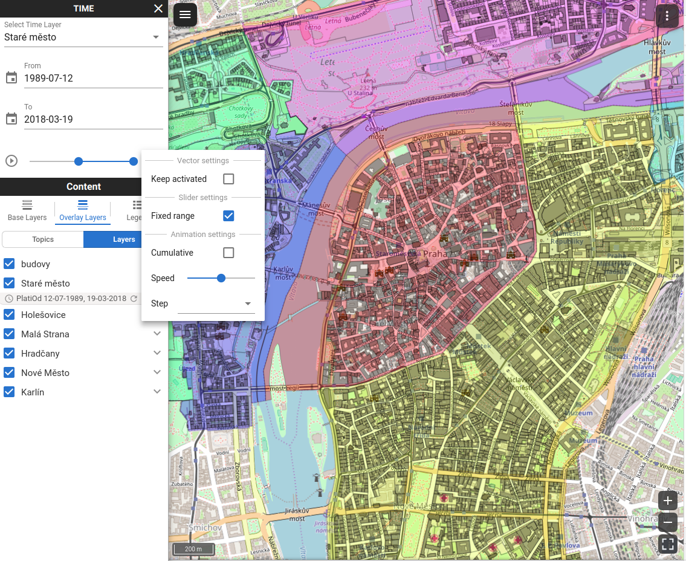
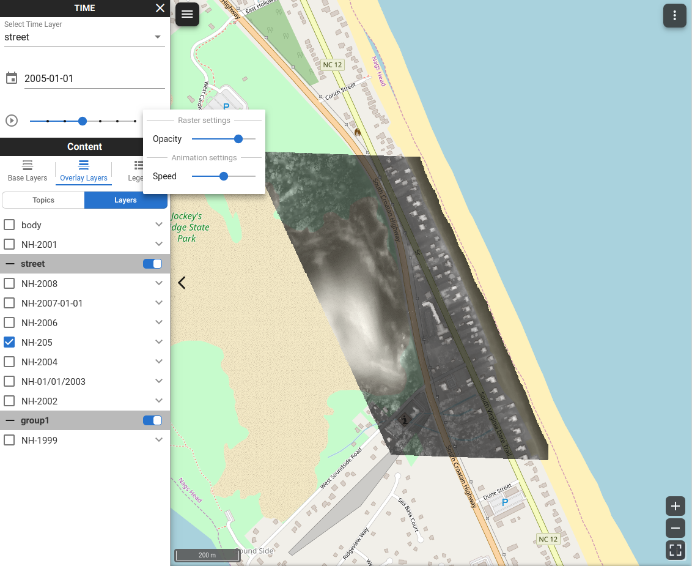

# GSoC 2018 project

The main goal of this project is extend a basic filtering tool that was being developed as a part of my final thesis. Originaly it is focused on spatio-temporal vector data filtering only. This project focuses on support for general spatio-temporal both vector and raster data, as well as other functionalities that will make it easy to handle by every client and make the data publishing more effective.

This repository contains Gisquick web klient in the branch 'vue-client'. All the development douring coding period was made in this branch.

<b>Prague districts with parcels selected by their date of change in cadastre</b>

<b>Raster layers containing thermal photos of Jockey's Ridge State Park in Virginia</b>

## Run docker container

[Docker](https://docs.docker.com/install/) is required in order to run Gisquick images.

Navigate to .../docker and run $ docker-compose up

Application is served on port 443

This application does not contain any project. For information about adding published project please visit [official documentation](http://gisquick.readthedocs.io/en/latest/administrator-manual/installation/docker.html)

# Gisquick

Gisquick (http://gisquick.org) is designed as an **open source
platform for publishing geospatial data** in the sense of rapid
sharing QGIS projects on the web. The platform consists of QGIS
plugin, Django-based server application, QGIS server, and web/mobile
clients. The clients are designed with a goal to put together minimal
set of functions for useful generic responsive web and mobile friendly
mapping application.

For more information see [Gisquick
documentation](http://gisquick.readthedocs.io).

## License

[GNU General Public License version
2](https://github.com/gislab-npo/gisquick/blob/master/LICENSE) or
later.

## Contact

info at gisquick.org
